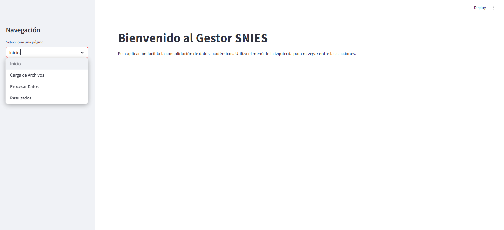
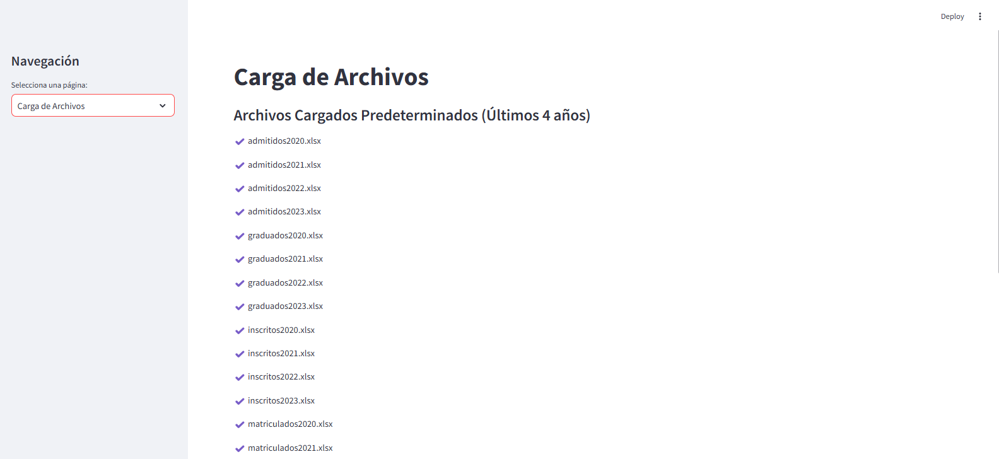
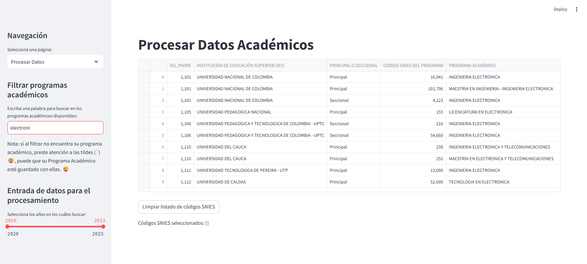
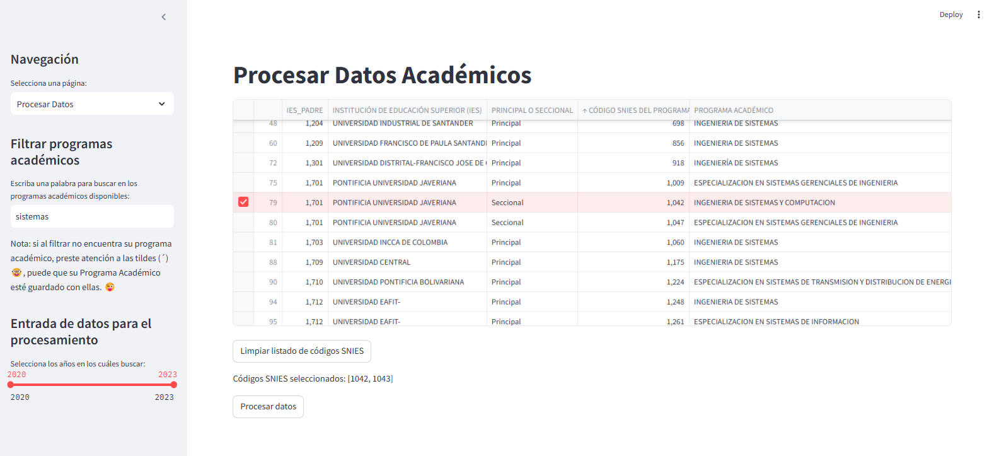
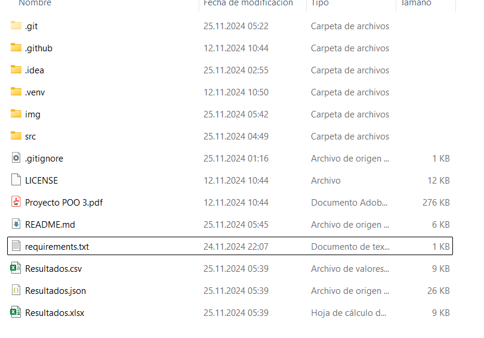
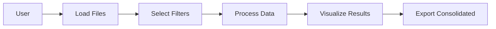
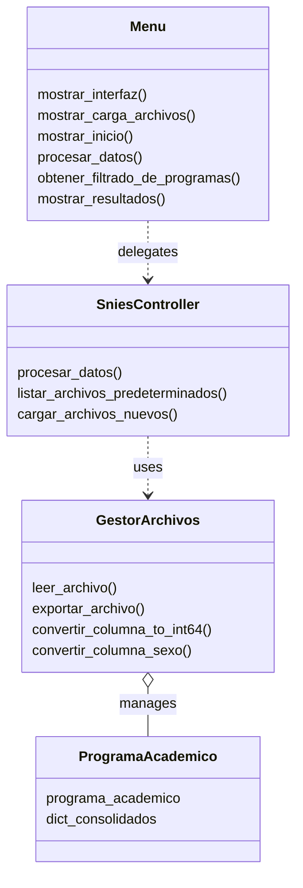

# SNIES Extractor

[](https://www.python.org/)
[](https://streamlit.io/)
[](LICENSE)

> **Professional tool for processing and analyzing data from Colombia's National Higher Education Information System (SNIES)**

An interactive web application that automates academic data management, allowing users to load, filter, process, and export university program information with an intuitive and modern interface.



## Table of Contents

- [Key Features](#key-features)
- [Technologies](#technologies)
- [Installation](#installation)
- [Usage](#usage)
- [System Architecture](#system-architecture)
- [Technical Documentation](#technical-documentation)
- [Contributing](#contributing)
- [License](#license)
- [Contact](#contact)

## Key Features

- **Intelligent Filtering**: Search by keywords and custom year ranges
- **Batch Processing**: Handles multiple Excel files simultaneously
- **Data Visualization**: Interactive charts and dynamic tables
- **Flexible Export**: Generates consolidated files in CSV and JSON formats
- **Modern Interface**: Built with Streamlit for a smooth user experience
- **High Performance**: Optimized data processing with Pandas
- **Detailed Analysis**: Information on enrolled, admitted, graduated students, and more

## Technologies

This project is built with the following technologies:

| Technology                                                                                            | Purpose                   |
| ----------------------------------------------------------------------------------------------------- | ------------------------- |
|           | Core language             |
|  | Interactive web framework |
|           | Data processing           |
|           | Data visualization        |

**Main libraries:**

- `pandas`: Data manipulation and analysis
- `streamlit`: Web user interface
- `openpyxl`: Excel file reading/writing
- `plotly`: Interactive charts

## Installation

### Prerequisites

- Python 3.8 or higher
- pip (Python package manager)

### Installation Steps

1. **Clone the repository**

```bash
git clone https://github.com/Casc0de/snies-extractor-python-puj.git
cd snies-extractor-python-puj
```

2. **Create a virtual environment (recommended)**

```bash
python -m venv venv
```

3. **Activate the virtual environment**

- Windows: in a command prompt window use:

```bash
venv\Scripts\activate
```

- Linux/Mac:

```bash
source venv/bin/activate
```

4. **Install dependencies**

```bash
pip install -r requirements.txt
```

## Usage

### Running the Application

```bash
streamlit run src/main.py
```

The application will automatically open in your browser at `http://localhost:8501`

### Basic Workflow

1. **Load Files**: Upload your Excel files or use the sample files
   

2. **Filter Data**: Apply filters by keywords and year ranges
   

3. **Visualize Results**: Explore data with interactive tables and charts
   

4. **Export**: Download processed results in CSV or JSON format
   

## Project Objective

To facilitate efficient management of SNIES educational data by automating processes that traditionally required manual Excel file manipulation, reducing errors and saving valuable time in academic data analysis.

## System Architecture

The system follows a three-layer architecture with separation of concerns:

```
┌─────────────────────────────────────┐
│   User Interface (Streamlit)       │  ← Presentation Layer
├─────────────────────────────────────┤
│      SNIES Controller               │  ← Business Logic Layer
├─────────────────────────────────────┤
│      File Manager                   │  ← Data Access Layer
└─────────────────────────────────────┘
```

### Main Components

1. **User Interface (Streamlit)**:
   - Interactive web interface for loading and processing files
   - Filtering by keywords and year ranges
   - Real-time results visualization
   - Processed file downloads

2. **SNIES Controller**:
   - Business logic management
   - Coordination between interface and data layer
   - Request validation and processing

3. **File Manager**:
   - Excel file reading and writing
   - Data processing with Pandas
   - Consolidated file generation

### Processing Flow



1. **File Loading**: Import Excel files with academic data
2. **Processing**: Organize data by academic program and year
3. **Export**: Generate consolidated files for analysis

---

## Technical Documentation

<details>
<summary><b>View implementation details</b></summary>

### Project Structure

```
snies-python-cascode/
│
├── src/
│   ├── main.py              # Application entry point
│   ├── view.py              # User interface (Streamlit)
│   ├── sniesController.py   # Business logic
│   ├── gestorArchivos.py    # File management
│   ├── programaAcademico.py # Data model
│   └── graficas.py          # Visualization generation
│
├── img/                     # Screenshots and visual assets
├── requirements.txt         # Project dependencies
├── Resultados.csv          # Output file (CSV)
├── Resultados.json         # Output file (JSON)
└── README.md               # This file
```

### Main Classes

#### 1. `GestorArchivos`

```python
class GestorArchivos:
     """Manages reading, processing, and exporting Excel files"""
     - leer_archivo()              # Reads Excel files
     - exportar_archivo()          # Exports consolidated data
     - convertir_columna_to_int64() # Converts data types
     - convertir_columna_sexo()    # Processes demographic data
```

#### 2. `ProgramaAcademico`

```python
class ProgramaAcademico:
     """Represents an academic program with its consolidated data"""
     - programa_academico          # Program name
     - dict_consolidados          # Dictionary with data by year
```

#### 3. `SniesController`

```python
class SniesController:
     """Controls the system's business logic"""
     - procesar_datos()                    # Processes loaded files
     - listar_archivos_predeterminados()  # Lists available files
     - cargar_archivos_nuevos()           # Loads new files
```

#### 4. `Menu (View)`

```python
class Menu:
     """User interface with Streamlit"""
     - mostrar_interfaz()                 # Main interface
     - mostrar_carga_archivos()          # Loading module
     - procesar_datos()                   # Processing
     - obtener_filtrado_de_programas()   # Apply filters
     - mostrar_resultados()              # Visualization
```

### Class Diagram



### Processed Data Types

- **Matriculados**: Students enrolled per semester
- **Admitidos**: Newly admitted students
- **Graduados**: Students who completed the program
- **Inscritos**: Received admission applications
- **Neos**: First-time enrolled students

</details>

---

## Contributing

Contributions are welcome. If you want to improve this project:

1. Fork the repository
2. Create a branch for your feature (`git checkout -b feature/AmazingFeature`)
3. Commit your changes (`git commit -m 'Add some AmazingFeature'`)
4. Push to the branch (`git push origin feature/AmazingFeature`)
5. Open a Pull Request

## License

This project is licensed under the MIT License. See the [LICENSE](LICENSE) file for details.

## Contact

**Esteban** - Full Stack Developer

- LinkedIn: [Your LinkedIn profile](https://www.linkedin.com/in/your-profile)
- GitHub: [@your-username](https://github.com/your-username)
- Email: your.email@example.com

---

<div align="center">

**If you found this project useful, consider giving it a star**

Developed with care to facilitate educational data analysis in Colombia

</div>
